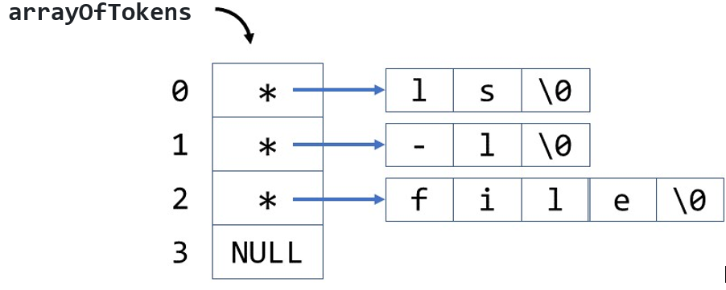

# PA1: Parsing a String Into Tokens

## Objective
The purpose of this assignment is to write a function that will *parse* a string into *tokens* (or *words*), similar to what the shell is required to do.

## Description
For this assignment, you are to write a function in C with the following prototype:

```c
int getTokens(char *s, char ***args);  // or int getTokens(char s[], char **args[]);
```

This is the correct function prototype --- don't change it! This function should accept a (C-type) string and a pointer to a pointer to `char` (or, if you prefer, a pointer to an array of pointers to `char`) (i.e., a pointer to the same type as `argv` in a C program), and should point `args` to an array with each element being a pointer pointing to the separate tokens extracted from the string, and it should return a number of tokens. If some problem occurred during the operation of the function, the value returned should be `-1`. 

For example, if you were to call the function using the following code:
```c
char **arrayOfTokens, str[] = "ls -l file";
int numberOfTokens;
numberOfToken = getTokens(str, &arrayOfTokens);
```
it should produce the following situation in memory:



The important part of this exercise is the function you write. However, for consistency in grading, your main program should ask the user to input a line, call the function, then print out the number of tokens found, and finally, print out the token, one per line.
### Example of output: 
````
Please, enter the string: ls -l   file
Number of tokens: 3
token 1: ls
token 2: -l
token 3: file
token 4: (null)
````

Note that, as in the example above, the value of the pointer argument is undefined when it is passed to the `getTokens` function. `getTokens` must allocate any dynamic memory necessary for use by the program. (The array used for the unparsed string need not be dynamically allocated.)

**Note:** The input sting might have multiple spaces.

**Note:** `strtok()` may not be used for parsing.

## Submitting Assignments
1. Ensure that you `push` your local copy of this PA's repo to GitHub. Verify that the code in GitHub is the same code you have on your local computer.
2. You may continue to update and push your code into this repo as long as it is before the deadline.
3. It is VERY IMPORTANT that besides pushing the code to GitHub that you still submit the GitHub URL of this programming assignment in Canvas. This allows the instructor to be notified of your final submission and that you are ready for grading.

> ***NOTE: By submitting your code to be graded, you are stating that your submission does not violate the Academic Integrity Policy outlined in the syllabus.***
